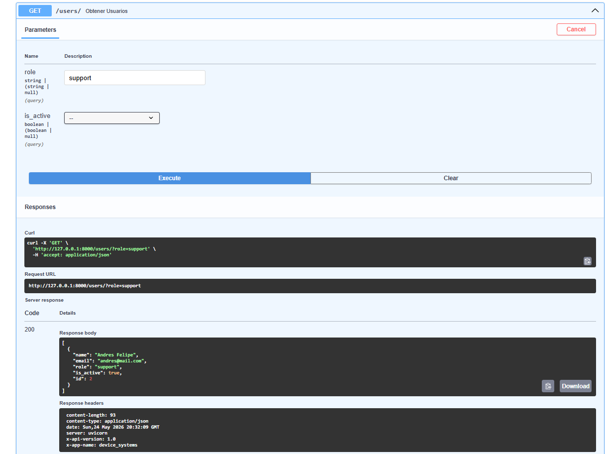
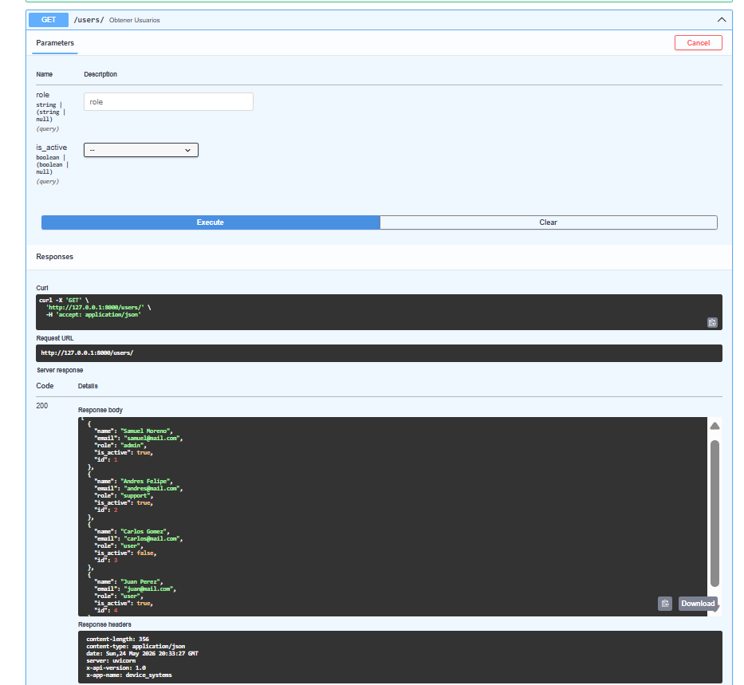
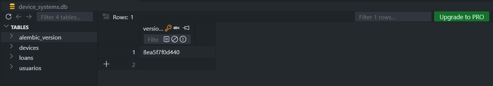
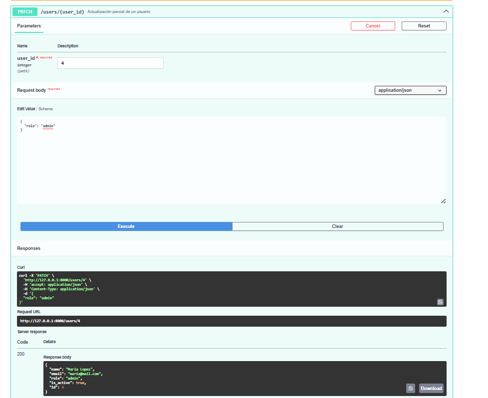

#  device_systems — API REST de Gestión de Usuarios

API REST construida con **FastAPI** para la gestión del recurso `users` dentro del sistema `device_systems`. Incluye validación de datos con Pydantic v2, parámetros de ruta y consulta, modelos de respuesta y cabeceras HTTP personalizadas.

---

## Estructura del proyecto

```
device_systems/
│── app/
│   │── main.py
│   │── schemas/
│   │   └── user_schema.py
│   └── routes/
│       └── user_routes.py
│── requirements.txt
└── README.md
```

---

## Instalación de dependencias

Clona el repositorio e instala las dependencias:

```bash
git clone https://github.com/tu-usuario/device_systems.git
cd device_systems
pip install -r requirements.txt
```

Contenido del `requirements.txt`:

```
fastapi
uvicorn
pydantic[email]
```

---

## Ejecución del servidor

```bash
uvicorn app.main:app --reload
```

La API quedará disponible en: [http://127.0.0.1:8000](http://127.0.0.1:8000)

Documentación interactiva (Swagger UI): [http://127.0.0.1:8000/docs](http://127.0.0.1:8000/docs)

---

## Tabla de endpoints

| Método | Endpoint              | Descripción                              |
|--------|-----------------------|------------------------------------------|
| GET    | `/users`              | Lista todos los usuarios                 |
| GET    | `/users/{user_id}`    | Obtiene un usuario por su ID             |
| GET    | `/users?role=admin`   | Filtra usuarios por rol                  |
| GET    | `/users?is_active=true` | Filtra usuarios por estado activo      |
| POST   | `/users`              | Registra un nuevo usuario                |

---

## Capturas de Swagger UI

### 1. Vista general de Swagger UI

> _Captura que muestra todos los endpoints disponibles en la documentación interactiva._



---

### 2. Prueba GET `/users`

> _Evidencia de la ejecución del endpoint GET /users retornando la lista de usuarios._



---

### 3. Prueba GET `/users/{user_id}`

> _Evidencia de la consulta de un usuario específico mediante su ID como Path Parameter._


---

### 4. Prueba POST `/users`

> _Evidencia del registro exitoso de un nuevo usuario con validación Pydantic._



---

### 5. Validaciones y errores

> _Evidencia del manejo de errores: correo duplicado, campo inválido o rol no permitido._



---

## Reflexión sobre el uso de FastAPI para construir APIs REST

Trabajar con **FastAPI** en este taller fue una excelente experiencia. Lo que más me gustó fue lo rápido que se puede levantar un servidor funcional sin configuraciones complejas, además de la **documentación automática con Swagger UI** (`/docs`), que nos ahorró mucho tiempo al darnos una interfaz lista para probar los endpoints y sacar las evidencias.

La combinación con **Pydantic v2** es clave para controlar los datos; basta con definir el molde con las reglas (como el correo válido o el largo del nombre) y el framework frena los datos malos automáticamente, devolviendo errores claros. 

Finalmente, el proyecto me ayudó a entender la diferencia práctica entre **Path Parameters** (para buscar un recurso único como el ID) y **Query Parameters** (ideales para filtrar listas como con los roles), además de la ventaja de usar **Response Models** para proteger la API mostrando solo la información que el cliente realmente necesita ver.

---

## Cabeceras HTTP personalizadas

Todos los endpoints retornan las siguientes cabeceras personalizadas:

```
X-App-Name: device_systems
X-API-Version: 1.0
```
---

### Video De Sustentación

*   **Enlace al video (Loom):** https://www.loom.com/share/87e20ffdf47142a6ad4916dd32e030a1

