# device_systems — API REST de Gestión de Usuarios v2.0

API REST construida con **FastAPI** para la gestión del recurso `users` dentro del sistema `device_systems`. Implementa arquitectura limpia con separación en capas, CRUD completo, validación con Pydantic v2, Dependency Injection, manejo profesional de errores y documentación automática con Swagger/OpenAPI.

---

## Tecnologías utilizadas

- **Python 3.x**
- **FastAPI 0.110+** — Framework web moderno y de alto rendimiento
- **Uvicorn 0.28+** — Servidor ASGI para correr la aplicación
- **Pydantic v2** — Validación y serialización de datos
- **email-validator** — Validación de formato de correos electrónicos

---

## Estructura del proyecto

```
device_systems/
│── app/
│   │── main.py
│   │── data/
│   │   └── users_db.py
│   │── dependencies/
│   │   └── user_dependencies.py
│   │── schemas/
│   │   └── user_schema.py
│   │── routes/
│   │   └── user_routes.py
│   └── services/
│       └── user_service.py
│── requirements.txt
└── README.md
```

---

## Instalación de dependencias

Clona el repositorio e instala las dependencias:

```bash
git clone https://github.com/tu-usuario/device_systems.git
cd device_systems
pip install -r requirements.txt
```

Contenido del `requirements.txt`:

```
fastapi>=0.110.0
uvicorn>=0.28.0
pydantic[email]>=2.6.0
```

---

## Ejecución del servidor

```bash
uvicorn app.main:app --reload
```

La API quedará disponible en: [http://127.0.0.1:8000](http://127.0.0.1:8000)

Documentación interactiva Swagger UI: [http://127.0.0.1:8000/docs](http://127.0.0.1:8000/docs)

Documentación alternativa ReDoc: [http://127.0.0.1:8000/redoc](http://127.0.0.1:8000/redoc)

---

## Tabla de endpoints

| Método | Endpoint                  | Descripción                          | Status         |
| ------- | ------------------------- | ------------------------------------- | -------------- |
| GET     | `/users`                | Lista todos los usuarios              | 200 OK         |
| GET     | `/users/{user_id}`      | Obtiene un usuario por su ID          | 200 OK         |
| GET     | `/users?role=admin`     | Filtra usuarios por rol               | 200 OK         |
| GET     | `/users?is_active=true` | Filtra usuarios por estado activo     | 200 OK         |
| POST    | `/users`                | Registra un nuevo usuario             | 201 Created    |
| PUT     | `/users/{user_id}`      | Actualización completa de un usuario | 200 OK         |
| PATCH   | `/users/{user_id}`      | Actualización parcial de un usuario  | 200 OK         |
| DELETE  | `/users/{user_id}`      | Elimina un usuario del sistema        | 204 No Content |

---

## Códigos de estado HTTP utilizados

| Código | Nombre               | Cuándo se usa                             |
| ------- | -------------------- | ------------------------------------------ |
| 200     | OK                   | GET, PUT y PATCH exitosos                  |
| 201     | Created              | POST exitoso, usuario creado               |
| 204     | No Content           | DELETE exitoso, sin cuerpo de respuesta    |
| 400     | Bad Request          | Correo duplicado o PATCH enviado sin datos |
| 404     | Not Found            | Usuario no encontrado por ID               |
| 422     | Unprocessable Entity | Datos inválidos detectados por Pydantic   |

---

## 🔍 Ejemplos de peticiones y respuestas

### GET `/users` — Listar todos los usuarios

```
GET http://127.0.0.1:8000/users
```

**Response `200 OK`:**

```json
[
  {
    "id": 1,
    "name": "Samuel Moreno",
    "email": "samuel@mail.com",
    "role": "admin",
    "is_active": true
  }
]
```

---

### GET `/users/{user_id}` — Consultar usuario por ID

```
GET http://127.0.0.1:8000/users/1
```

**Response `200 OK`:**

```json
{
  "id": 1,
  "name": "Samuel Moreno",
  "email": "samuel@mail.com",
  "role": "admin",
  "is_active": true
}
```

---

### POST `/users` — Registrar nuevo usuario

```
POST http://127.0.0.1:8000/users
Content-Type: application/json
```

**Body:**

```json
{
  "name": "Laura Gomez",
  "email": "laura@mail.com",
  "role": "support",
  "is_active": true
}
```

**Response `201 Created`:**

```json
{
  "id": 6,
  "name": "Laura Gomez",
  "email": "laura@mail.com",
  "role": "support",
  "is_active": true
}
```

---

### PUT `/users/{user_id}` — Actualización completa

```
PUT http://127.0.0.1:8000/users/1
Content-Type: application/json
```

**Body:**

```json
{
  "name": "Samuel Moreno Actualizado",
  "email": "samuel_nuevo@mail.com",
  "role": "support",
  "is_active": false
}
```

**Response `200 OK`:**

```json
{
  "id": 1,
  "name": "Samuel Moreno Actualizado",
  "email": "samuel_nuevo@mail.com",
  "role": "support",
  "is_active": false
}
```

---

### PATCH `/users/{user_id}` — Actualización parcial

```
PATCH http://127.0.0.1:8000/users/1
Content-Type: application/json
```

**Body (solo los campos a cambiar):**

```json
{
  "role": "support"
}
```

**Response `200 OK`:**

```json
{
  "id": 1,
  "name": "Samuel Moreno",
  "email": "samuel@mail.com",
  "role": "support",
  "is_active": true
}
```

---

### DELETE `/users/{user_id}` — Eliminar usuario

```
DELETE http://127.0.0.1:8000/users/1
```

**Response `204 No Content`** — Sin cuerpo de respuesta.

---

## Dependency Injection con `Depends()`

El proyecto utiliza `Depends()` de FastAPI para **reutilizar lógica común** entre múltiples endpoints sin repetir código. Las dependencias están definidas en `app/dependencies/user_dependencies.py`.

### `get_user_or_404`

Busca un usuario por su ID en la base de datos. Si no existe, lanza automáticamente un error `404 Not Found` antes de que el endpoint se ejecute. Se usa en GET por ID, PUT, PATCH y DELETE.

```python
def get_user_or_404(user_id: int) -> dict:
    for usuario in db_users:
        if usuario["id"] == user_id:
            return usuario
    raise HTTPException(status_code=404, detail="El usuario que buscas no existe.")
```

Uso en una ruta:

```python
@router.get("/{user_id}", response_model=UserResponse)
def buscar_por_id(usuario: dict = Depends(get_user_or_404)):
    return usuario
```

### `verificar_correo_duplicado`

Recorre la base de datos y valida que el correo enviado no esté registrado por otro usuario. Acepta un parámetro `excluir_id` para que al editar un usuario no se estalle contra su propio correo actual.

```python
def verificar_correo_duplicado(email: str, excluir_id: int = None):
    for usuario in db_users:
        if usuario["email"] == email and usuario["id"] != excluir_id:
            raise HTTPException(status_code=400, detail="Ese correo ya existe, intenta con otro.")
```

---

## El Manejo de errores implementado

La API maneja los siguientes escenarios de error usando `HTTPException`:

| Escenario                       | Código | Mensaje de respuesta                                  |
| ------------------------------- | ------- | ----------------------------------------------------- |
| Usuario no encontrado           | 404     | `"El usuario que buscas no existe."`                |
| Correo electrónico duplicado   | 400     | `"Ese correo ya existe, intenta con otro."`         |
| PATCH enviado sin ningún campo | 400     | `"Intento de actualización sin datos..."`          |
| Datos inválidos (Pydantic)     | 422     | Detalle automático de FastAPI con el campo inválido |

Todos los errores retornan una respuesta JSON con la siguiente estructura:

```json
{
  "detail": "Mensaje descriptivo del error"
}
```

---

## Capturas de Swagger UI

### 1. GET `/users` — Listar todos los usuarios

> _Evidencia de la ejecución del endpoint GET /users retornando la lista completa de usuarios._


---

### 2. GET `/users/{user_id}` — Consultar por ID

> _Evidencia de la consulta de un usuario específico mediante su ID como Path Parameter._


---

### 3. POST `/users` — Registrar nuevo usuario

> _Evidencia del registro exitoso de un nuevo usuario con validación Pydantic y respuesta 201 Created._


---

### 4. PUT `/users/{user_id}` — Actualización completa

> _Evidencia de la actualización completa de un usuario, reemplazando todos sus campos con respuesta 200 OK._


---

### 5. PATCH `/users/{user_id}` — Actualización parcial

> _Evidencia de la actualización parcial enviando solo los campos a modificar, con respuesta 200 OK._


---

### 6. DELETE `/users/{user_id}` — Eliminar usuario

> _Evidencia de la eliminación exitosa de un usuario con respuesta 204 No Content._

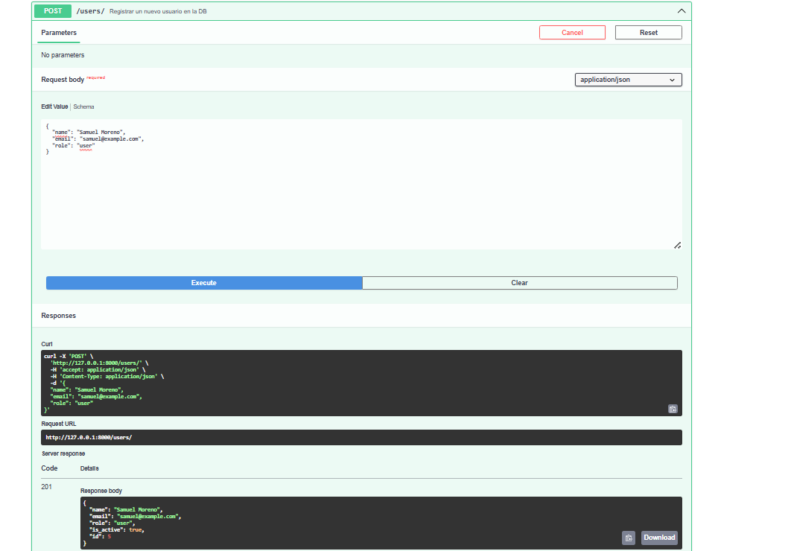

---

### 7. Error — Correo duplicado

> _Evidencia del manejo de error al intentar registrar o actualizar un usuario con un correo ya existente, retornando 400 Bad Request._


---

## 💡 Reflexión sobre el uso de FastAPI para construir APIs REST

Trabajar con **FastAPI** en este taller fue una excelente experiencia. Lo que más me gustó fue lo rápido que se puede levantar un servidor funcional sin configuraciones complejas, además de la **documentación automática con Swagger UI** (`/docs`), que nos ahorró mucho tiempo al darnos una interfaz lista para probar los endpoints y sacar las evidencias.

La combinación con **Pydantic v2** es clave para controlar los datos; basta con definir el molde con las reglas (como el correo válido o el largo del nombre) y el framework frena los datos malos automáticamente, devolviendo errores claros.

Además, la arquitectura del proyecto evolucionó hacia un patrón más limpio separando responsabilidades: las **rutas** solo reciben y responden, los **servicios** contienen la lógica del negocio, y las **dependencias** manejan validaciones reutilizables como `get_user_or_404` y `verificar_correo_duplicado`. Esto hace el código mucho más organizado y fácil de mantener.

Finalmente, el proyecto me ayudó a entender la diferencia práctica entre **Path Parameters** (para buscar un recurso único como el ID), **Query Parameters** (ideales para filtrar listas), y los diferentes métodos HTTP: `POST` para crear, `PUT` para reemplazar completamente, `PATCH` para actualizar solo los campos enviados, y `DELETE` para eliminar retornando `204 No Content`.

---

## 🛡️ Cabeceras HTTP personalizadas

Todos los endpoints retornan las siguientes cabeceras personalizadas:

```
X-App-Name: device_systems
X-API-Version: 2.0
```

### Sustentación en Video sobre la Actividad 7

* **Enlace al video (Loom):** https://www.loom.com/share/87e20ffdf47142a6ad4916dd32e030a1

# device_systems — API REST con Persistencia SQLite v3.0

API REST construida con **FastAPI** y **SQLAlchemy** para la gestión del recurso `users` dentro del sistema `device_systems`. Esta versión evoluciona la API anterior hacia persistencia real con base de datos SQLite, reemplazando el almacenamiento en memoria por un motor de base de datos relacional con modelos ORM, sesiones controladas y consultas SQL generadas automáticamente.

---

## Tecnologías utilizadas

- **Python 3.x**
- **FastAPI 0.110+** — Framework web moderno y de alto rendimiento
- **Uvicorn 0.28+** — Servidor ASGI para ejecutar la aplicación
- **SQLAlchemy 2.x** — ORM para gestión de la base de datos relacional
- **SQLite** — Base de datos relacional ligera, sin servidor adicional
- **Pydantic v2** — Validación y serialización de datos de entrada/salida
- **email-validator** — Validación de formato de correos electrónicos

---

## Estructura del proyecto

> _Captura de la estructura del proyecto en el editor de código._


```
device_systems/
│── app/
│   │── main.py
│   │── database/
│   │   └── connection.py
│   │── models/
│   │   └── user_model.py
│   │── schemas/
│   │   └── user_schema.py
│   │── routes/
│   │   └── user_routes.py
│   │── services/
│   │   └── user_service.py
│   └── dependencies/
│       └── database_dependency.py
│── device_systems.db
│── requirements.txt
└── README.md
```

---

## Instalación de dependencias

Clona el repositorio e instala las dependencias:

```bash
git clone https://github.com/tu-usuario/device_systems.git
cd device_systems
pip install -r requirements.txt
```

Contenido del `requirements.txt`:

```
fastapi>=0.110.0
uvicorn>=0.28.0
pydantic[email]>=2.6.0
sqlalchemy>=2.0.0
```

---

## Ejecución del servidor

```bash
uvicorn app.main:app --reload
```

Al arrancar, FastAPI ejecuta `create_tables()` automáticamente, lo que crea el archivo `device_systems.db` si no existe y genera la tabla `usuarios` dentro de él.

La API quedará disponible en: [http://127.0.0.1:8000](http://127.0.0.1:8000)

Documentación Swagger UI: [http://127.0.0.1:8000/docs](http://127.0.0.1:8000/docs)

Documentación ReDoc: [http://127.0.0.1:8000/redoc](http://127.0.0.1:8000/redoc)

---

## Base de datos generada

Al ejecutar el servidor por primera vez se genera automáticamente el archivo `device_systems.db` en la raíz del proyecto. Este archivo es la base de datos SQLite que almacena de forma persistente todos los usuarios registrados.

> _Captura del archivo `device_systems.db` generado y su tabla `usuarios` vista desde un cliente SQLite._


---

## Tabla de endpoints

| Método | Endpoint                  | Descripción                          | Status         |
| ------- | ------------------------- | ------------------------------------- | -------------- |
| GET     | `/users`                | Lista todos los usuarios              | 200 OK         |
| GET     | `/users?role=admin`     | Filtra usuarios por rol               | 200 OK         |
| GET     | `/users?is_active=true` | Filtra por estado activo              | 200 OK         |
| GET     | `/users?order_by=name`  | Ordena resultados por nombre o fecha  | 200 OK         |
| GET     | `/users/{user_id}`      | Obtiene un usuario por su ID          | 200 OK         |
| POST    | `/users`                | Registra un nuevo usuario en la DB    | 201 Created    |
| PUT     | `/users/{user_id}`      | Actualización completa de un usuario | 200 OK         |
| PATCH   | `/users/{user_id}`      | Actualización parcial de un usuario  | 200 OK         |
| DELETE  | `/users/{user_id}`      | Elimina un usuario de la DB           | 204 No Content |

---

## Códigos de estado HTTP utilizados

| Código | Nombre               | Cuándo se usa                             |
| ------- | -------------------- | ------------------------------------------ |
| 200     | OK                   | GET, PUT y PATCH exitosos                  |
| 201     | Created              | POST exitoso, usuario creado en la DB      |
| 204     | No Content           | DELETE exitoso, sin cuerpo de respuesta    |
| 400     | Bad Request          | Correo duplicado o PATCH enviado sin datos |
| 404     | Not Found            | Usuario no encontrado por ID en la DB      |
| 422     | Unprocessable Entity | Datos inválidos detectados por Pydantic   |

---

## 🔍 Ejemplos de peticiones y respuestas

### GET `/users` — Listar todos los usuarios

```
GET http://127.0.0.1:8000/users
```

**Response `200 OK`:**

```json
[
  {
    "id": 1,
    "name": "Samuel Moreno",
    "email": "samuel@mail.com",
    "role": "admin",
    "is_active": true
  }
]
```

---

### GET `/users/{user_id}` — Consultar por ID

```
GET http://127.0.0.1:8000/users/1
```

**Response `200 OK`:**

```json
{
  "id": 1,
  "name": "Samuel Moreno",
  "email": "samuel@mail.com",
  "role": "admin",
  "is_active": true
}
```

---

### POST `/users` — Registrar nuevo usuario

```
POST http://127.0.0.1:8000/users
Content-Type: application/json
```

**Body:**

```json
{
  "name": "Laura Gomez",
  "email": "laura@mail.com",
  "role": "support",
  "is_active": true
}
```

**Response `201 Created`:**

```json
{
  "id": 2,
  "name": "Laura Gomez",
  "email": "laura@mail.com",
  "role": "support",
  "is_active": true
}
```

---

### PUT `/users/{user_id}` — Actualización completa

```
PUT http://127.0.0.1:8000/users/1
Content-Type: application/json
```

**Body:**

```json
{
  "name": "Samuel Moreno Actualizado",
  "email": "samuel_nuevo@mail.com",
  "role": "support",
  "is_active": false
}
```

**Response `200 OK`:**

```json
{
  "id": 1,
  "name": "Samuel Moreno Actualizado",
  "email": "samuel_nuevo@mail.com",
  "role": "support",
  "is_active": false
}
```

---

### PATCH `/users/{user_id}` — Actualización parcial

```
PATCH http://127.0.0.1:8000/users/1
Content-Type: application/json
```

**Body (solo los campos a cambiar):**

```json
{
  "role": "user"
}
```

**Response `200 OK`:**

```json
{
  "id": 1,
  "name": "Samuel Moreno",
  "email": "samuel@mail.com",
  "role": "user",
  "is_active": true
}
```

---

### DELETE `/users/{user_id}` — Eliminar usuario

```
DELETE http://127.0.0.1:8000/users/1
```

**Response `204 No Content`** — Sin cuerpo de respuesta. El registro es eliminado permanentemente de la base de datos.

---

## Capturas

### 1. Estructura del proyecto

> _Vista de la organización de carpetas y archivos del proyecto en el editor de código._

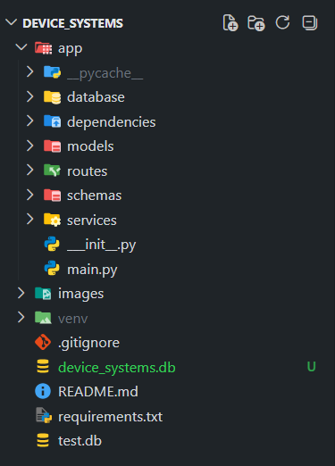

---

### 2. Base de datos generada

> _Archivo `device_systems.db` generado automáticamente al arrancar el servidor, con la tabla `usuarios` visible desde un cliente SQLite._

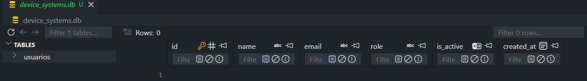

---

### 3. Swagger UI — Vista general

> _Vista de todos los endpoints disponibles en la documentación interactiva de FastAPI._

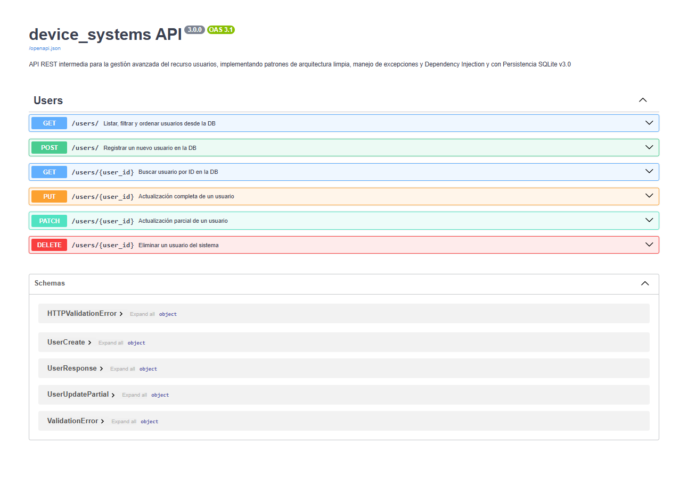

---

### 4. GET `/users` — Listar usuarios

> _Evidencia del endpoint GET /users retornando la lista de usuarios desde la base de datos._

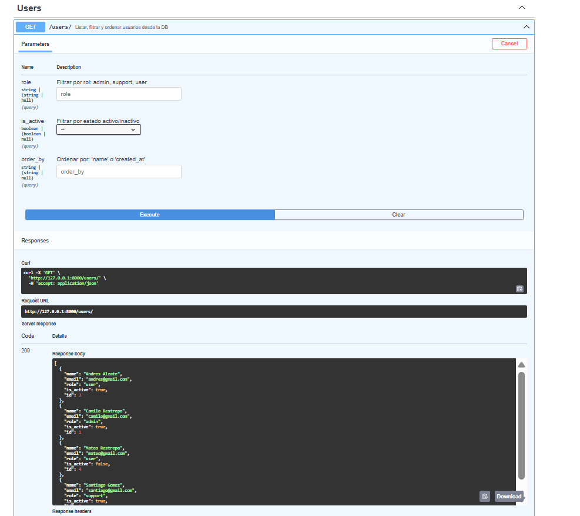

---

### 5. GET `/users/{user_id}` — Consultar por ID

> _Evidencia de la consulta de un usuario específico mediante su ID como Path Parameter._

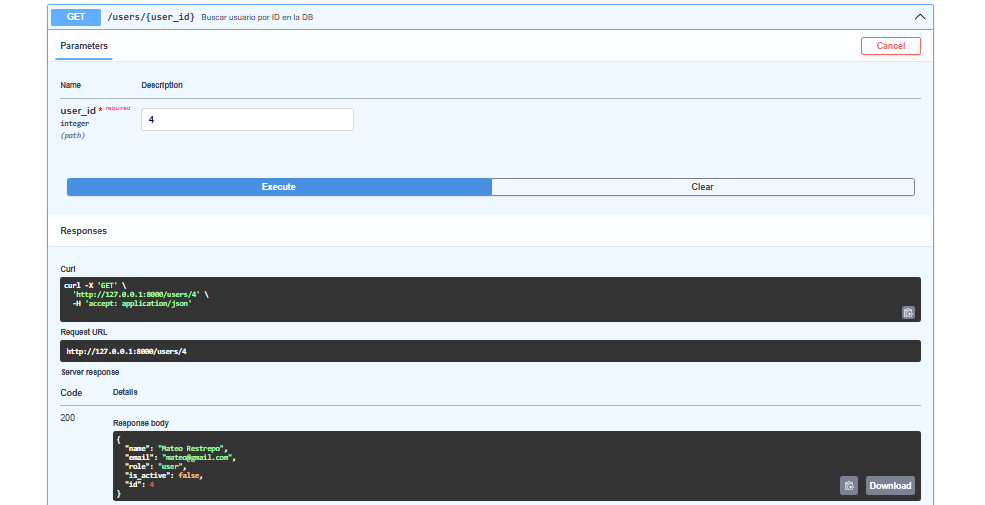

---

### 6. POST `/users` — Registrar usuario

> _Evidencia del registro exitoso de un nuevo usuario persistido en la base de datos, con respuesta 201 Created._

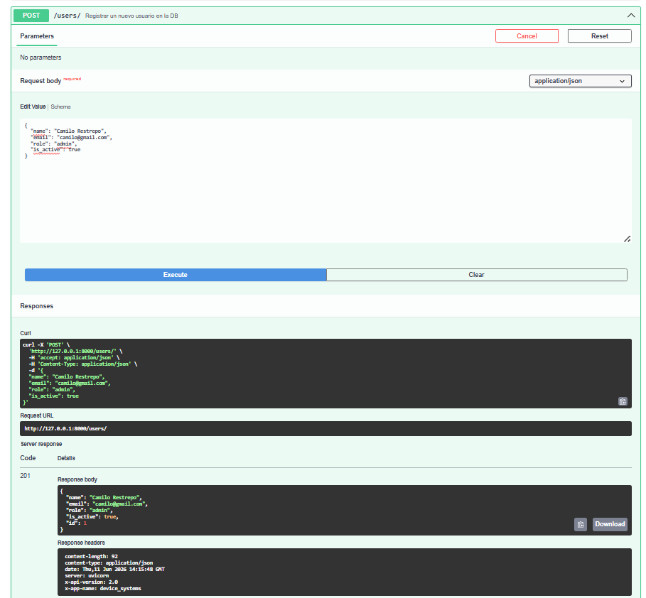

---

### 7. PUT `/users/{user_id}` — Actualización completa

> _Evidencia de la actualización completa de un usuario reemplazando todos sus campos, con respuesta 200 OK._

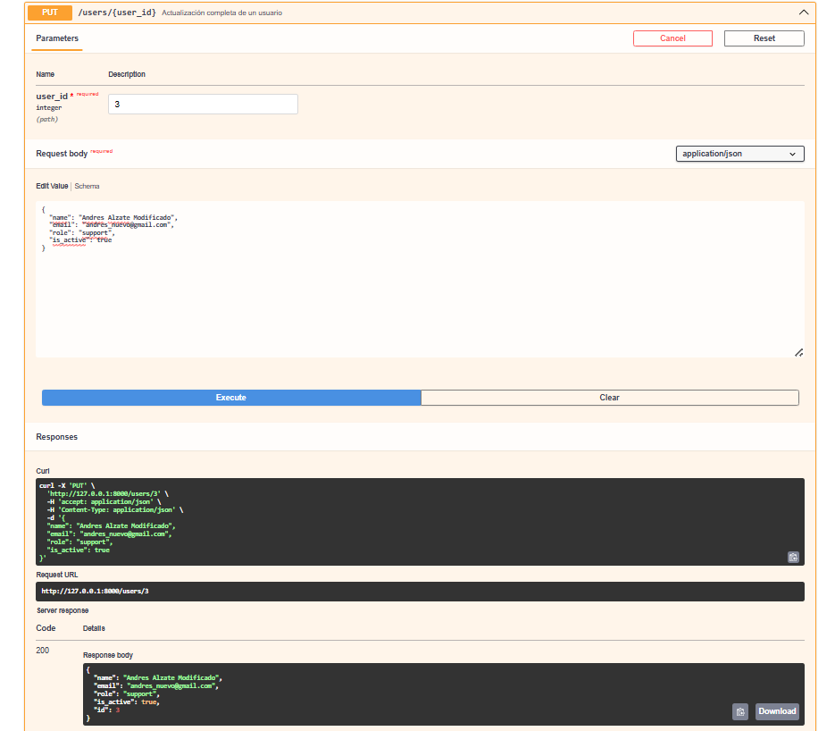

---

### 8. PATCH `/users/{user_id}` — Actualización parcial

> _Evidencia de la actualización parcial enviando solo los campos a modificar, con respuesta 200 OK._

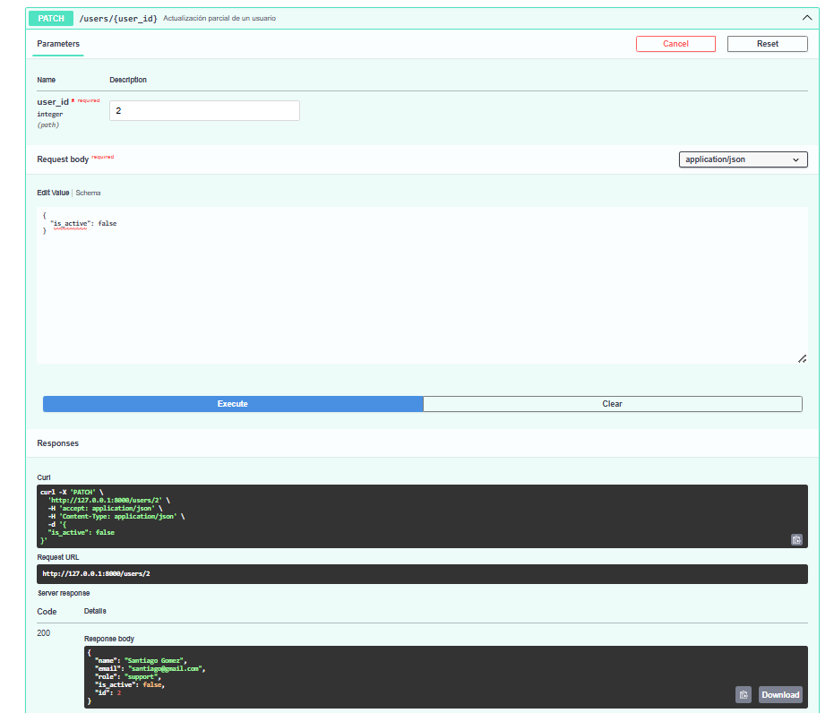

---

### 9. DELETE `/users/{user_id}` — Eliminar usuario

> _Evidencia de la eliminación permanente de un usuario de la base de datos, con respuesta 204 No Content._

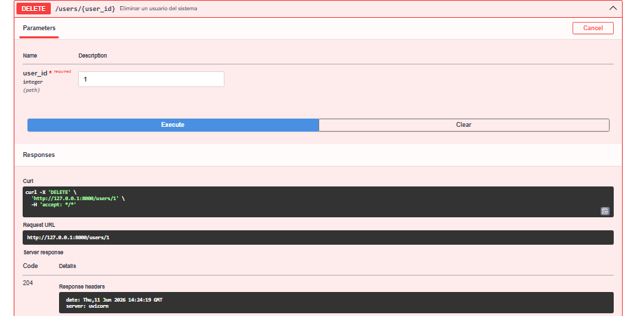

---

### 10. Error — Correo duplicado (400)

> _Evidencia del error al intentar registrar un correo ya existente, retornando 400 Bad Request._

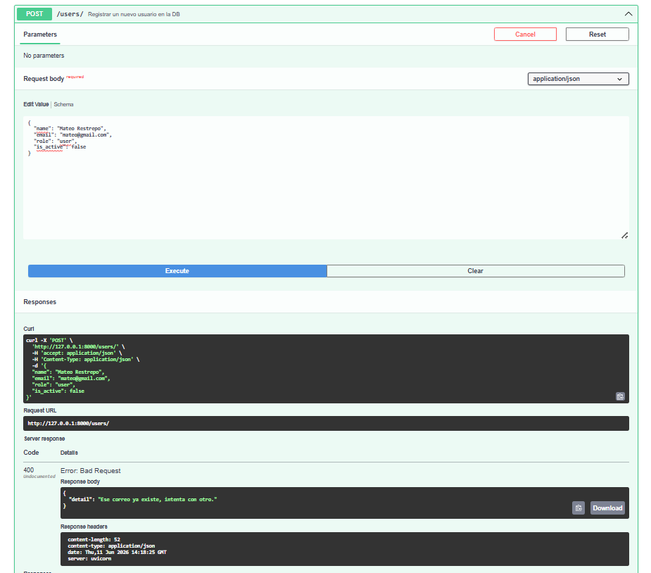

---

### 11. Error — Datos inválidos (422)

> _Evidencia del error al enviar datos que no cumplen las validaciones de Pydantic, retornando 422 Unprocessable Entity._

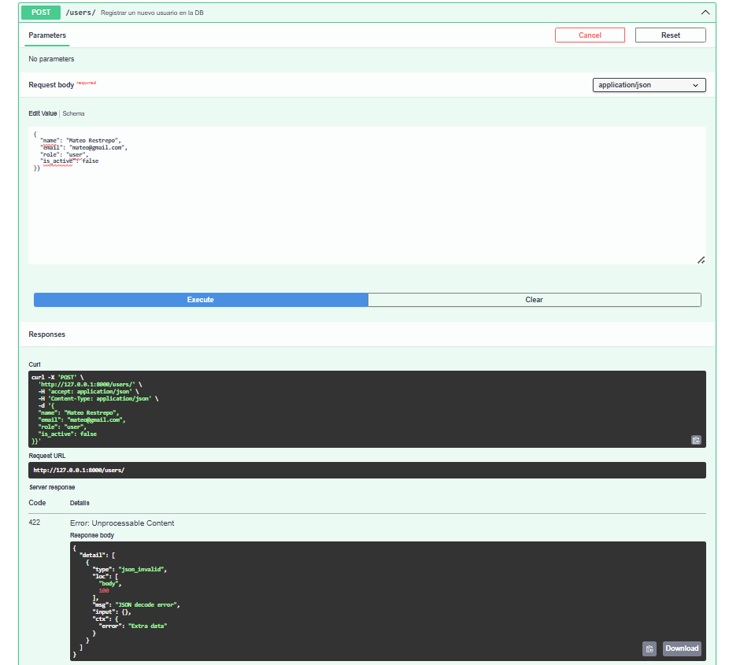

---

## 🔗 Dependency Injection con `Depends()`

El proyecto usa `Depends()` de FastAPI para reutilizar lógica común entre múltiples endpoints. Las dependencias están en `app/dependencies/database_dependency.py`.

### `get_db` — Ciclo de vida de la sesión

Abre una sesión de base de datos para cada petición y la cierra automáticamente al terminar, sin importar si hubo error o no. Todos los endpoints que necesitan acceder a la DB la inyectan con `Depends(get_db)`.

```python
def get_db():
    db = SessionLocal()
    try:
        yield db
    finally:
        db.close()
```

### `get_user_or_404` — Buscar o lanzar 404

Recibe el `user_id` de la URL, ejecuta un `SELECT` en la DB y retorna el usuario si existe. Si no lo encuentra, lanza automáticamente un `404 Not Found` antes de que el endpoint se ejecute.

```python
def get_user_or_404(user_id: int, db: Session = Depends(get_db)) -> Usuario:
    usuario = db.query(Usuario).filter(Usuario.id == user_id).first()
    if not usuario:
        raise HTTPException(status_code=404, detail="El usuario que buscas no existe.")
    return usuario
```

### `verificar_correo_duplicado` — Validar unicidad del correo

Consulta la DB para verificar que el correo no esté registrado por otro usuario. Acepta un `excluir_id` para que al editar no colisione con el propio correo del usuario que se está modificando.

```python
def verificar_correo_duplicado(email: str, db: Session, excluir_id: int = None):
    query = db.query(Usuario).filter(Usuario.email == email)
    if excluir_id is not None:
        query = query.filter(Usuario.id != excluir_id)
    if query.first():
        raise HTTPException(status_code=400, detail="Ese correo ya existe, intenta con otro.")
```

---

## Manejo de errores implementado

| Escenario                       | Código | Mensaje de respuesta                                                      |
| ------------------------------- | ------- | ------------------------------------------------------------------------- |
| Usuario no encontrado           | 404     | `"El usuario que buscas no existe."`                                    |
| Correo electrónico duplicado   | 400     | `"Ese correo ya existe, intenta con otro."`                             |
| PATCH enviado sin ningún campo | 400     | `"Intento de actualización sin datos. Debe enviar al menos un campo."` |
| Datos inválidos (Pydantic)     | 422     | Detalle automático de FastAPI con el campo inválido                     |

Todos los errores retornan:

```json
{
  "detail": "Mensaje descriptivo del error"
}
```

---

## Diferencia entre Modelo SQLAlchemy y Schema Pydantic

En este proyecto conviven dos tipos de "modelos" que cumplen roles completamente distintos dentro de la arquitectura.

### Modelo SQLAlchemy — `app/models/user_model.py`

Representa la **estructura de la tabla en la base de datos**. Hereda de `Base` y le dice a SQLAlchemy cómo mapear una clase Python a una tabla SQL real. Sus atributos son columnas (`Column`) con tipos de datos de la DB (`Integer`, `String`, `Boolean`).

```python
class Usuario(Base):
    __tablename__ = "usuarios"
    id       = Column(Integer, primary_key=True, autoincrement=True)
    name     = Column(String, nullable=False)
    email    = Column(String, unique=True, nullable=False)
    role     = Column(String, nullable=False)
    is_active = Column(Boolean, default=True)
    created_at = Column(DateTime, default=lambda: datetime.now(timezone.utc))
```

Su responsabilidad es **hablar con la base de datos**: leer, insertar, actualizar y eliminar registros.

---

### Schema Pydantic — `app/schemas/user_schema.py`

Representa las **reglas de validación de los datos que entran y salen de la API**. Hereda de `BaseModel` y define qué campos acepta el cliente, con qué formato y con qué restricciones. No sabe nada de la base de datos.

```python
class UserCreate(BaseModel):
    name:      str = Field(..., min_length=3)
    email:     EmailStr
    role:      Literal["admin", "support", "user"]
    is_active: bool = True
```

Su responsabilidad es **hablar con el cliente HTTP**: validar lo que llega en el body del request y moldear lo que se retorna en la respuesta.

---

### Resumen de la diferencia

| Característica          | Modelo SQLAlchemy (`Usuario`) | Schema Pydantic (`UserCreate`)  |
| ------------------------ | ------------------------------- | --------------------------------- |
| Hereda de                | `Base` (SQLAlchemy)           | `BaseModel` (Pydantic)          |
| Representa               | Una tabla en la base de datos   | Datos de entrada/salida de la API |
| Responsabilidad          | Persistencia y consultas SQL    | Validación y serialización HTTP |
| Conoce la DB             | ✅ Sí                          | ❌ No                             |
| Valida datos del cliente | ❌ No                           | ✅ Sí                            |

Usar ambos en capas separadas es una práctica profesional: el schema protege la entrada de datos, y el modelo gestiona su almacenamiento.

---

## Reflexión sobre la importancia de usar persistencia en una API

El cambio más significativo en esta versión del proyecto fue migrar de una lista en memoria a una base de datos real con SQLAlchemy y SQLite, y esa diferencia se nota de inmediato en la robustez de la API.

Con el almacenamiento en memoria, cada vez que se reiniciaba el servidor todos los datos desaparecían. Era útil para aprender la estructura de FastAPI, pero completamente inviable en un escenario real. Incorporar persistencia con SQLite cambió eso: los usuarios registrados sobreviven a los reinicios, pueden ser consultados, actualizados y eliminados de forma confiable, y el historial de datos se mantiene intacto.

SQLAlchemy también trajo otra ventaja que no esperaba: permite trabajar con la base de datos usando Python puro, sin escribir SQL manualmente. El ORM traduce las operaciones (`db.query()`, `db.add()`, `db.commit()`) a sentencias SQL reales de forma automática, lo que reduce errores y hace el código más legible.

Finalmente, entender la separación entre el modelo ORM y el schema Pydantic fue clave. Al principio parece redundante tener dos representaciones del mismo "usuario", pero en la práctica cada uno cumple un rol bien definido: Pydantic protege lo que entra por HTTP, y SQLAlchemy gestiona lo que se guarda en disco. Esa separación de responsabilidades es lo que hace que una API sea mantenible a largo plazo.

---

## Cabeceras HTTP personalizadas

Todos los endpoints retornan las siguientes cabeceras personalizadas:

```
X-App-Name: device_systems
X-API-Version: 3.0
```

---

# device_systems — Sistema de Gestión de Préstamos de Dispositivos v4.0

API REST construida con **FastAPI**, **SQLAlchemy** y **Alembic** para la gestión de un sistema de préstamos de dispositivos. El proyecto evoluciona el recurso `users` original incorporando dos nuevas entidades relacionadas — `devices` y `loans` — junto con migraciones de base de datos versionadas, relaciones uno-a-muchos, consultas con JOIN y filtros avanzados.

---

## Tecnologías utilizadas

- **Python 3.x**
- **FastAPI 0.110+** — Framework web para construir la API
- **Uvicorn 0.28+** — Servidor ASGI
- **SQLAlchemy 2.x** — ORM y definición de relaciones entre tablas
- **Alembic** — Sistema de migraciones para versionar el esquema de la base de datos
- **SQLite** — Base de datos relacional
- **Pydantic v2** — Validación y serialización de datos

---

## Estructura del proyecto

```
device_systems/
│── alembic/
│   │── versions/
│   └── env.py
│── alembic.ini
│── app/
│   │── main.py
│   │── database/
│   │   └── connection.py
│   │── models/
│   │   │── user_model.py
│   │   │── device_model.py
│   │   └── loan_model.py
│   │── schemas/
│   │   │── user_schema.py
│   │   │── device_schema.py
│   │   └── loan_schema.py
│   │── routes/
│   │   │── user_routes.py
│   │   │── device_routes.py
│   │   └── loan_routes.py
│   │── services/
│   │   │── user_service.py
│   │   │── device_service.py
│   │   └── loan_service.py
│   └── dependencies/
│       └── database_dependency.py
│── device_systems.db
│── requirements.txt
└── README.md
```

---

## Instalación de dependencias

```bash
git clone https://github.com/tu-usuario/device_systems.git
cd device_systems
pip install -r requirements.txt
```

Contenido del `requirements.txt`:

```
fastapi>=0.110.0
uvicorn>=0.28.0
pydantic[email]>=2.6.0
sqlalchemy>=2.0.0
alembic>=1.13.0
```

---

## Migraciones con Alembic

Este proyecto usa **Alembic** para versionar los cambios en el esquema de la base de datos, en lugar de depender únicamente de `Base.metadata.create_all()`. Esto permite llevar un historial de cada cambio estructural (tablas y columnas nuevas) y aplicarlo de forma controlada.

### 1. Inicializar Alembic

```bash
alembic init alembic
```

Este comando crea la carpeta `alembic/` con el archivo `env.py` y el archivo de configuración `alembic.ini` en la raíz del proyecto.

> _Captura de la ejecución de `alembic init` en la terminal._


---

### 2. Generar una migración automática

```bash
alembic revision --autogenerate -m "Crear tablas devices y loans"
```

Alembic compara los modelos de SQLAlchemy (`Device`, `Loan`, `Usuario`) contra el estado actual de la base de datos y genera automáticamente el script de migración con los cambios detectados.

> _Captura de la generación de la migración con `--autogenerate`._


---

### 3. Aplicar la migración

```bash
alembic upgrade head
```

Este comando ejecuta todas las migraciones pendientes y deja la base de datos actualizada a la última versión (`head`), creando físicamente las tablas `usuarios`, `devices` y `loans` con sus respectivas relaciones y llaves foráneas.

> _Captura de la aplicación exitosa de la migración con `alembic upgrade head`._


---

## Ejecución del servidor

```bash
uvicorn app.main:app --reload
```

La API quedará disponible en: [http://127.0.0.1:8000](http://127.0.0.1:8000)

Documentación Swagger UI: [http://127.0.0.1:8000/docs](http://127.0.0.1:8000/docs)

---

## Estructura de tablas generadas

El sistema cuenta con tres tablas relacionadas entre sí:

| Tabla        | Descripción                                              | Relación                                  |
| ------------ | --------------------------------------------------------- | ------------------------------------------ |
| `usuarios` | Usuarios del sistema                                      | Un usuario puede tener muchos`loans`     |
| `devices`  | Dispositivos disponibles para préstamo                   | Un dispositivo puede tener muchos`loans` |
| `loans`    | Registro de préstamos, vincula`usuarios` y `devices` | Pertenece a un usuario y a un dispositivo  |

**`devices`**: `id`, `name`, `serial_number` (único), `device_type`, `brand`, `is_available`, `created_at`.

**`loans`**: `id`, `user_id` (FK → `usuarios.id`), `device_id` (FK → `devices.id`), `loan_date`, `return_date`, `status` (`active` / `returned`).

> _Captura de la estructura de las tablas generadas, vista desde un cliente SQLite (DB Browser, DBeaver, etc.)._


---

## Swagger UI — Vista general

> _Vista de todos los endpoints disponibles, organizados por tags: Users, Devices y Loans._


---

## Tabla de endpoints

| Método | Endpoint                    | Descripción                                         | Status         |
| ------- | --------------------------- | ---------------------------------------------------- | -------------- |
| GET     | `/users`                  | Lista, filtra y ordena usuarios                      | 200 OK         |
| GET     | `/users/{user_id}`        | Consulta un usuario por ID                           | 200 OK         |
| POST    | `/users`                  | Registra un nuevo usuario                            | 201 Created    |
| PUT     | `/users/{user_id}`        | Actualización completa de un usuario                | 200 OK         |
| PATCH   | `/users/{user_id}`        | Actualización parcial de un usuario                 | 200 OK         |
| DELETE  | `/users/{user_id}`        | Elimina un usuario                                   | 204 No Content |
| POST    | `/devices`                | Registra un nuevo dispositivo                        | 201 Created    |
| GET     | `/devices`                | Lista todos los dispositivos                         | 200 OK         |
| GET     | `/devices/{device_id}`    | Consulta un dispositivo por ID                       | 200 OK         |
| POST    | `/loans`                  | Registra el préstamo de un dispositivo a un usuario | 201 Created    |
| POST    | `/loans/{loan_id}/return` | Registra la devolución de un dispositivo prestado   | 200 OK         |
| GET     | `/loans`                  | Consulta historial de préstamos con JOIN y filtros  | 200 OK         |

---

## Evidencia de creación de Usuario, Dispositivo y Préstamo

### Crear usuario — `POST /users`

```
POST http://127.0.0.1:8000/users
Content-Type: application/json
```

```json
{
  "name": "Samuel Moreno",
  "email": "samuel@mail.com",
  "role": "admin",
  "is_active": true
}
```

> _Captura de Swagger UI ejecutando `POST /users` con respuesta 201 Created._


---

### Crear dispositivo — `POST /devices`

```
POST http://127.0.0.1:8000/devices
Content-Type: application/json
```

```json
{
  "name": "Laptop Dell Latitude",
  "serial_number": "SN-2024-001",
  "device_type": "laptop",
  "brand": "Dell"
}
```

> _Captura de Swagger UI ejecutando `POST /devices` con respuesta 201 Created._


---

### Crear préstamo — `POST /loans`

```
POST http://127.0.0.1:8000/loans
Content-Type: application/json
```

```json
{
  "user_id": 1,
  "device_id": 1
}
```

**Response `201 Created`:**

```json
{
  "id": 1,
  "user_id": 1,
  "device_id": 1,
  "loan_date": "2026-06-19T10:00:00Z",
  "return_date": null,
  "status": "active"
}
```

Al crear el préstamo, el dispositivo queda marcado automáticamente como `is_available: false`.

> _Captura de Swagger UI ejecutando `POST /loans` con respuesta 201 Created._

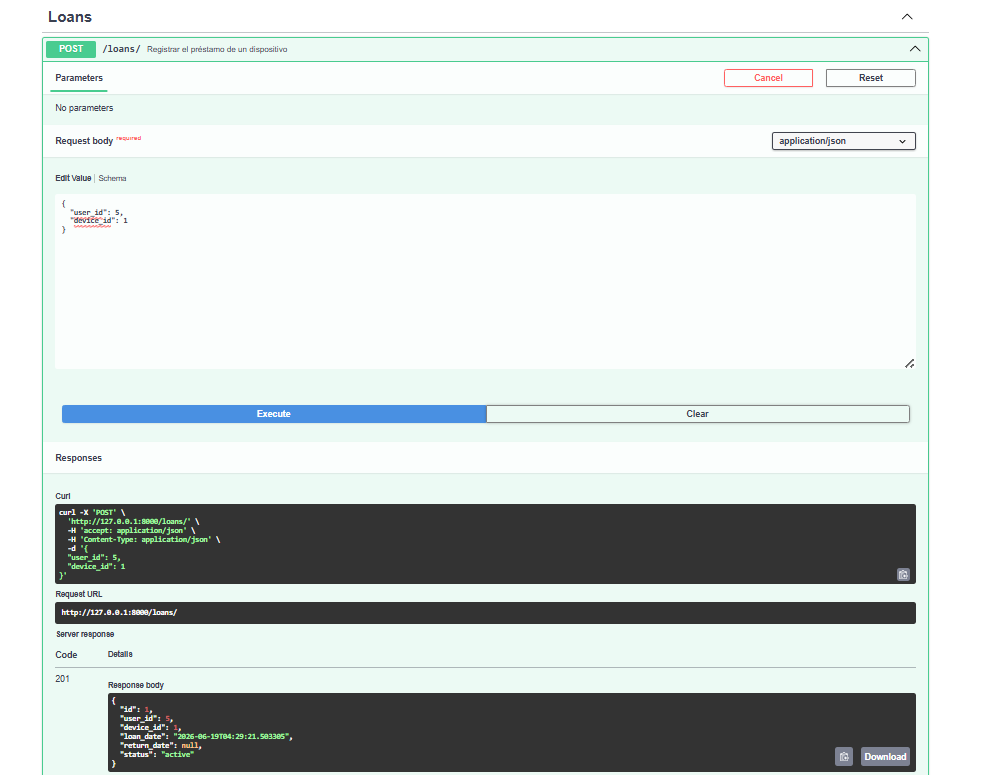

---

## Evidencia de consultas con JOIN

El endpoint `GET /loans` usa `.join(Loan.user).join(Loan.device)` para traer en una sola consulta el préstamo junto con los datos completos del usuario y del dispositivo relacionado, gracias al schema anidado `LoanDetailResponse`.

```
GET http://127.0.0.1:8000/loans
```

**Response `200 OK`:**

```json
[
  {
    "id": 1,
    "user_id": 1,
    "device_id": 1,
    "loan_date": "2026-06-19T10:00:00Z",
    "return_date": null,
    "status": "active",
    "user": {
      "id": 1,
      "name": "Samuel Moreno",
      "email": "samuel@mail.com",
      "role": "admin",
      "is_active": true
    },
    "device": {
      "id": 1,
      "name": "Laptop Dell Latitude",
      "serial_number": "SN-2024-001",
      "device_type": "laptop",
      "brand": "Dell",
      "is_available": false,
      "created_at": "2026-06-19T09:50:00Z"
    }
  }
]
```

> _Captura de la respuesta de `GET /loans` mostrando los datos anidados del usuario y del dispositivo (JOIN)._


---

## Evidencia de filtros aplicados

`GET /loans` acepta filtros opcionales por nombre de usuario y por estado del préstamo:

```
GET http://127.0.0.1:8000/loans?username=Samuel
GET http://127.0.0.1:8000/loans?status=active
GET http://127.0.0.1:8000/loans?username=Samuel&status=returned
```

- `username`: filtra usando coincidencia parcial (`ILIKE`) sobre el nombre del usuario.
- `status`: filtra de forma exacta por `active` o `returned`.

> _Captura de Swagger UI ejecutando `GET /loans` con los parámetros `username` y `status` aplicados._

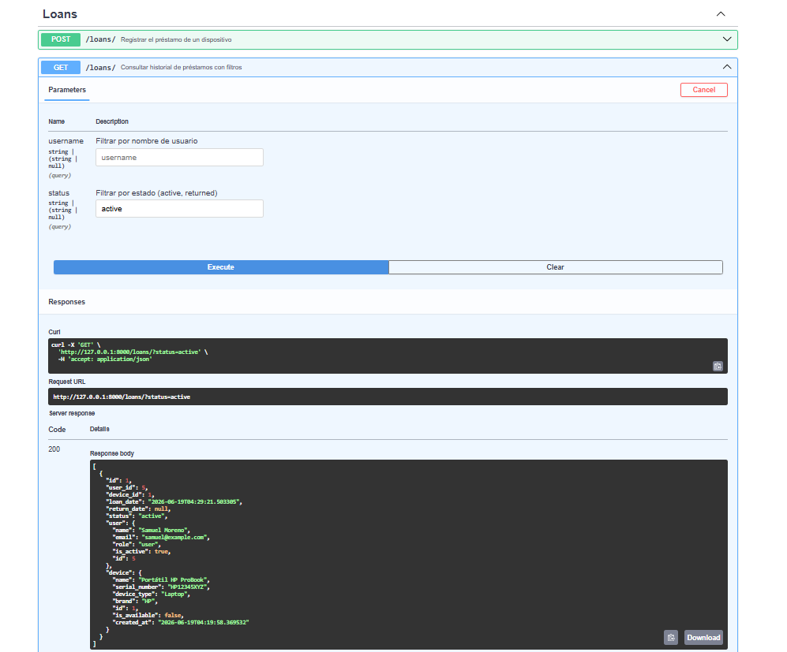

---

## Evidencia de devolución de dispositivo

```
POST http://127.0.0.1:8000/loans/1/return
```

**Response `200 OK`:**

```json
{
  "id": 1,
  "user_id": 1,
  "device_id": 1,
  "loan_date": "2026-06-19T10:00:00Z",
  "return_date": "2026-06-19T15:30:00Z",
  "status": "returned"
}
```

Al devolver el dispositivo, el `status` del préstamo cambia a `returned`, se registra `return_date`, y el dispositivo vuelve a marcarse como `is_available: true`, quedando disponible para un nuevo préstamo.

> _Captura de Swagger UI ejecutando `POST /loans/{loan_id}/return` y su respuesta exitosa._

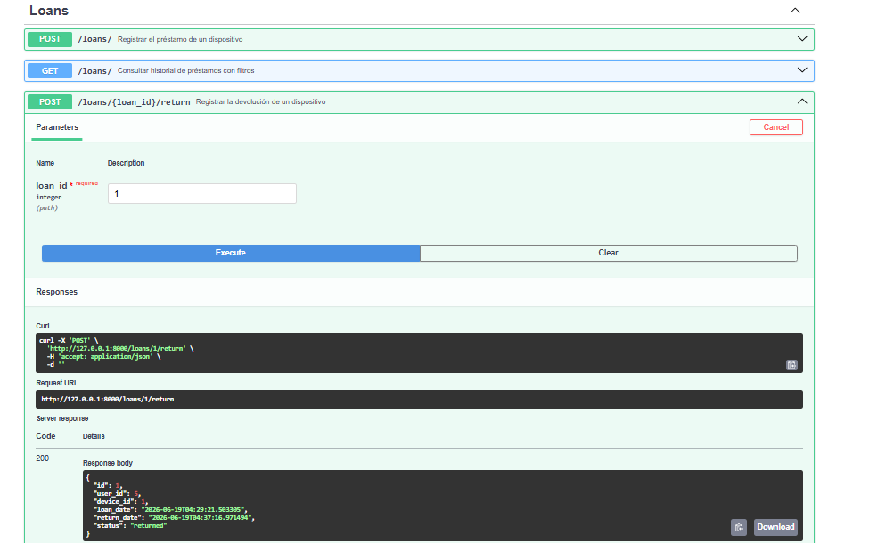

---

## Reflexión sobre la importancia de migraciones, relaciones y consultas avanzadas

Incorporar Alembic al proyecto cambió por completo la forma de manejar la base de datos. Antes, cualquier cambio en los modelos dependía de borrar el archivo `.db` y dejar que `create_all()` lo regenerara desde cero, lo cual es completamente inviable en un entorno real donde ya existen datos guardados. Con Alembic, cada cambio estructural queda registrado como una migración versionada: se puede ver exactamente qué cambió, en qué orden, y aplicarlo o revertirlo de forma controlada con `upgrade` y `downgrade`. Eso es justamente lo que diferencia un proyecto de práctica de un sistema preparado para producción.

Las relaciones entre tablas también le dieron sentido real al modelo de datos. Antes `users` era una entidad aislada; ahora un usuario puede tener muchos préstamos, un dispositivo puede tener muchos préstamos históricos, y cada préstamo conecta ambas entidades mediante llaves foráneas. Modelar esto con `relationship()` y `ForeignKey` en SQLAlchemy permitió que el ORM gestione automáticamente esas conexiones sin tener que escribir SQL manual para mantener la integridad referencial.

Finalmente, las consultas con `JOIN` fueron las que más valor agregaron a la API. En lugar de hacer múltiples peticiones desde el cliente para armar el historial de préstamos (una para el préstamo, otra para el usuario, otra para el dispositivo), el endpoint `GET /loans` resuelve todo en una sola consulta gracias a `.join(Loan.user).join(Loan.device)` y al schema anidado `LoanDetailResponse`. Sumado a los filtros por `username` y `status`, esto demuestra cómo una API bien diseñada puede entregar información rica y lista para consumir, reduciendo la carga de trabajo del lado del cliente.

---

## Cabeceras HTTP personalizadas

```
X-App-Name: device_systems
X-API-Version: 4.0
```

### Sustentación en Video sobre la Actividad 10

* **Enlace al video (Loom):** https://www.loom.com/share/6d9cb654234949b1a423f6cf2d9b4b12

----------------------------------------------

# device_systems — API REST Segura v5.0

API REST construida con **FastAPI** para la gestión de usuarios, dispositivos y préstamos del sistema `device_systems`. Esta versión incorpora una capa completa de seguridad: autenticación con **OAuth2 y JWT**, hash de contraseñas con **bcrypt**, protección de rutas por roles, middleware de auditoría, configuración **CORS** y **Rate Limiting** con slowapi.

---

## Tecnologías utilizadas

- **Python 3.x**
- **FastAPI 0.110+** — Framework web para construir la API
- **Uvicorn 0.28+** — Servidor ASGI
- **SQLAlchemy 2.x** — ORM y relaciones entre tablas
- **Alembic** — Migraciones versionadas de base de datos
- **SQLite** — Base de datos relacional
- **Pydantic v2** — Validación y serialización de datos
- **python-jose** — Generación y validación de tokens JWT
- **passlib / bcrypt** — Hash seguro de contraseñas
- **slowapi** — Rate limiting por endpoint
- **python-dotenv** — Variables de entorno desde `.env`

---

## Estructura del proyecto

> _Captura de la organización de carpetas y archivos del proyecto en VS Code._

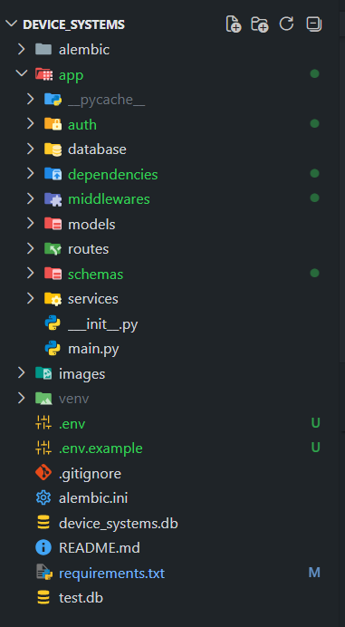

```
device_systems/
│── alembic/
│   └── versions/
│── app/
│   │── auth/
│   │   │── auth_routes.py
│   │   │── auth_service.py
│   │   └── security.py
│   │── database/
│   │   └── connection.py
│   │── dependencies/
│   │   │── auth_dependency.py
│   │   └── database_dependency.py
│   │── middlewares/
│   │   └── request_middleware.py
│   │── models/
│   │   │── user_model.py
│   │   │── device_model.py
│   │   └── loan_model.py
│   │── routes/
│   │   │── user_routes.py
│   │   │── device_routes.py
│   │   └── loan_routes.py
│   │── schemas/
│   │   │── auth_schema.py
│   │   │── user_schema.py
│   │   │── device_schema.py
│   │   └── loan_schema.py
│   │── services/
│   │   │── user_service.py
│   │   │── device_service.py
│   │   └── loan_service.py
│   └── main.py
│── .env
│── .env.example
│── alembic.ini
│── requirements.txt
└── README.md
```

---

## Instalación de dependencias

```bash
git clone https://github.com/tu-usuario/device_systems.git
cd device_systems
pip install -r requirements.txt
```

Contenido del `requirements.txt`:

```
fastapi>=0.110.0
uvicorn>=0.28.0
sqlalchemy>=2.0.0
alembic>=1.13.0
pydantic[email]>=2.6.0
python-jose[cryptography]
passlib[bcrypt]
slowapi
python-multipart
python-dotenv
email-validator
```

---

## Migración Alembic aplicada

> _Captura de la ejecución de `alembic revision --autogenerate` y `alembic upgrade head` en la terminal._

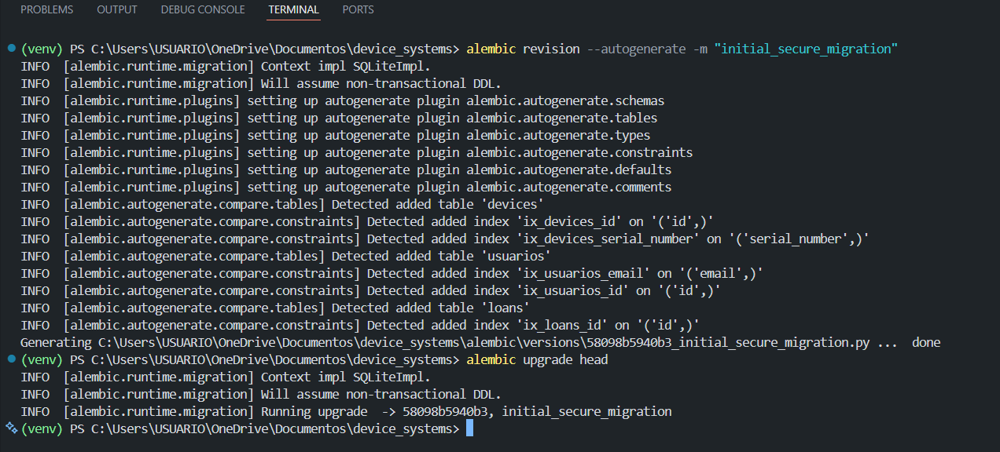

```bash
alembic revision --autogenerate -m "initial_secure_migration"
alembic upgrade head
```

---

## Ejecución del servidor

```bash
uvicorn app.main:app --reload
```

La API quedará disponible en: [http://127.0.0.1:8000](http://127.0.0.1:8000)

Swagger UI: [http://127.0.0.1:8000/docs](http://127.0.0.1:8000/docs)

---

## Tabla de endpoints

| Método | Endpoint                      | Descripción                              | Protección          | Status         |
|--------|-------------------------------|------------------------------------------|---------------------|----------------|
| POST   | `/auth/register`              | Registrar usuario con contraseña segura  | Pública             | 201 Created    |
| POST   | `/auth/login`                 | Login y generación de token JWT          | Pública             | 200 OK         |
| GET    | `/auth/me`                    | Datos del usuario autenticado            | Autenticado         | 200 OK         |
| GET    | `/users`                      | Listar, filtrar y ordenar usuarios       | Autenticado         | 200 OK         |
| GET    | `/users/{user_id}`            | Consultar usuario por ID                 | Autenticado         | 200 OK         |
| POST   | `/users`                      | Registrar usuario                        | Pública             | 201 Created    |
| PUT    | `/users/{user_id}`            | Actualización completa                   | Pública             | 200 OK         |
| PATCH  | `/users/{user_id}`            | Actualización parcial                    | Pública             | 200 OK         |
| DELETE | `/users/{user_id}`            | Eliminar usuario                         | Pública             | 204 No Content |
| POST   | `/devices`                    | Registrar dispositivo                    | Admin o Support     | 201 Created    |
| GET    | `/devices`                    | Listar dispositivos                      | Admin o Support     | 200 OK         |
| GET    | `/devices/{device_id}`        | Consultar dispositivo por ID             | Admin o Support     | 200 OK         |
| POST   | `/loans`                      | Registrar préstamo                       | Autenticado         | 201 Created    |
| GET    | `/loans`                      | Historial de préstamos con filtros       | Admin o Support     | 200 OK         |
| POST   | `/loans/{loan_id}/return`     | Registrar devolución                     | Admin o Support     | 200 OK         |

---

## Códigos de estado HTTP

| Código | Cuándo se usa                                           |
|--------|---------------------------------------------------------|
| 200    | GET, PUT, PATCH exitosos                                |
| 201    | POST exitoso (registro, préstamo, dispositivo)          |
| 204    | DELETE exitoso                                          |
| 400    | Correo duplicado, PATCH sin datos                       |
| 401    | Token inválido, ausente o credenciales incorrectas      |
| 403    | Token válido pero rol insuficiente                      |
| 422    | Datos inválidos detectados por Pydantic                 |
| 429    | Límite de peticiones superado (Rate Limiting)           |

---

## Capturas de pruebas funcionales

### 1. Registro de usuario — `POST /auth/register`

> _Registro exitoso de un usuario con contraseña segura. Respuesta `201 Created` sin exponer `hashed_password`._

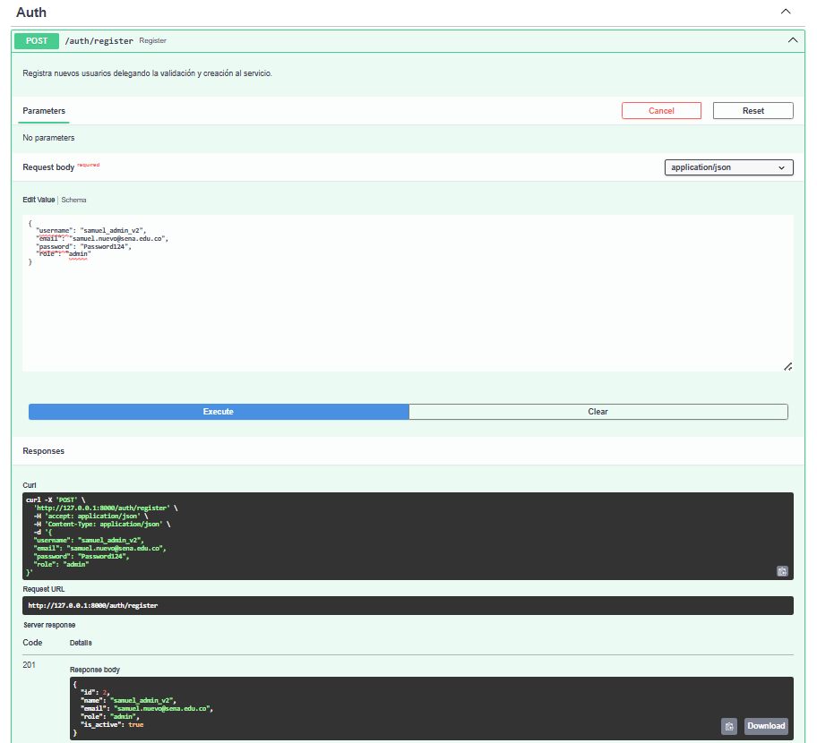

---

### 2. Login y token generado — `POST /auth/login`

> _Login exitoso con credenciales válidas. La respuesta incluye el `access_token` JWT con `token_type: bearer`._

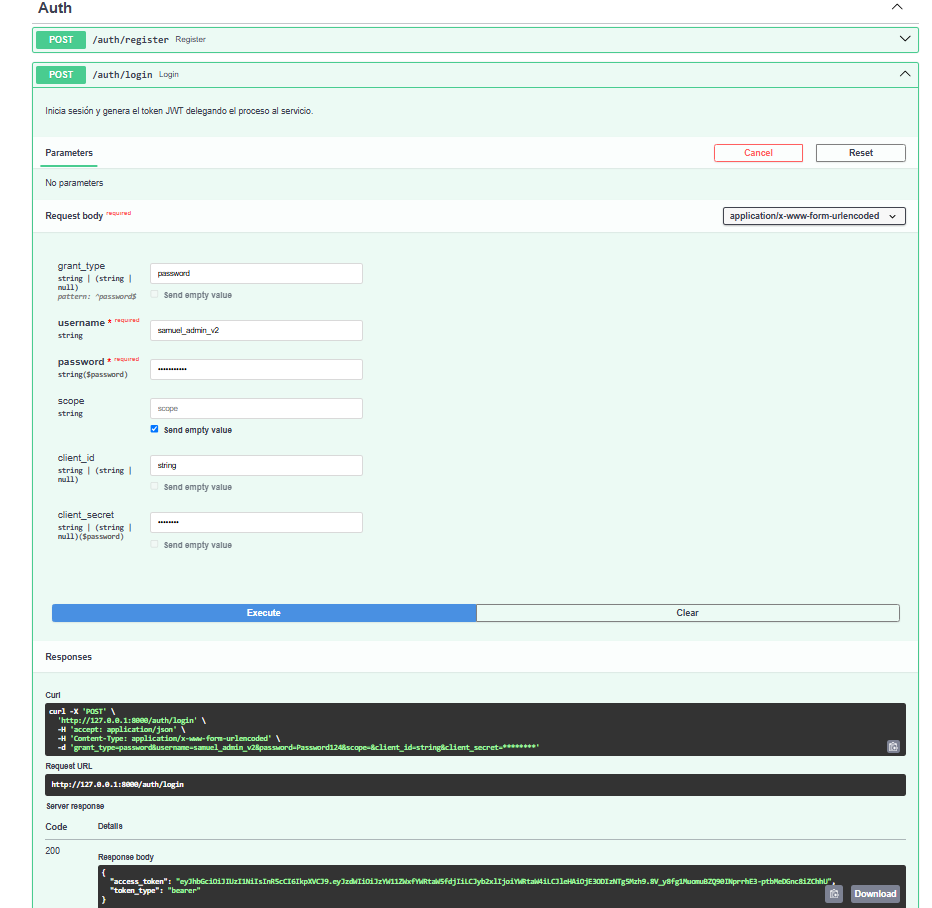

---

### 3. `/auth/me` y cabeceras del middleware

> _Consulta del perfil del usuario autenticado. En los response headers se aprecian las cabeceras generadas por el middleware: `x-app-name`, `x-process-time` y `x-request-id`._

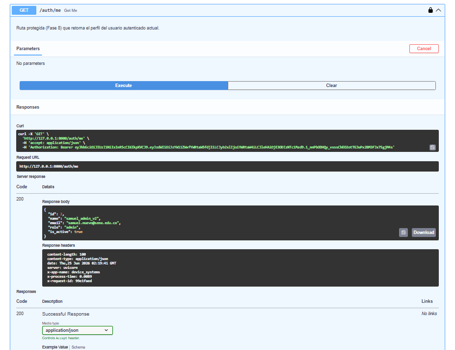

---

### 4. Registro con contraseña débil — `422 Unprocessable Entity`

> _Intento de registro con contraseña `1234`. Pydantic v2 rechaza automáticamente con el detalle del error de validación._

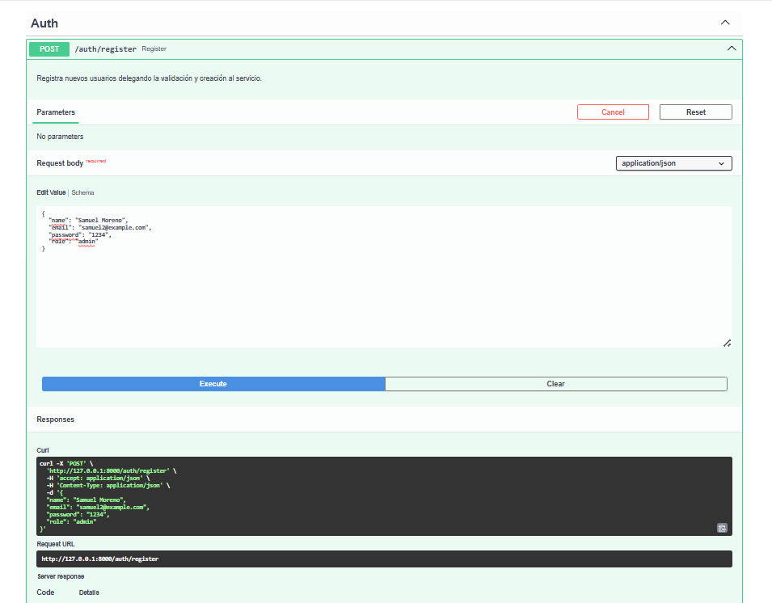

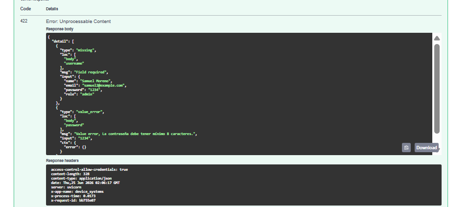

---

### 5. Acceso sin token — `401 Unauthorized`

> _Intento de acceder a `GET /users` sin estar autenticado. La API responde `401 Not authenticated`._

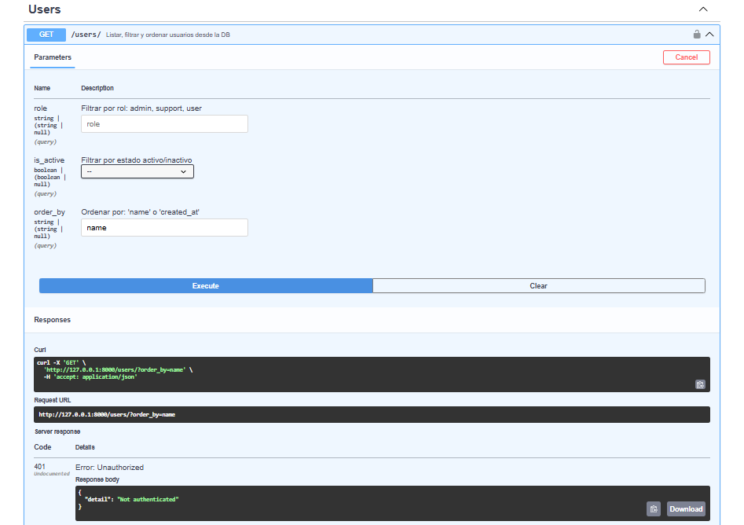

---

### 6. Acceso con rol no permitido — `403 Forbidden`

> _Usuario con rol `user` intentando ejecutar `POST /devices`. La API responde `403 Forbidden` con el mensaje "Permisos insuficientes para ejecutar esta operación."_

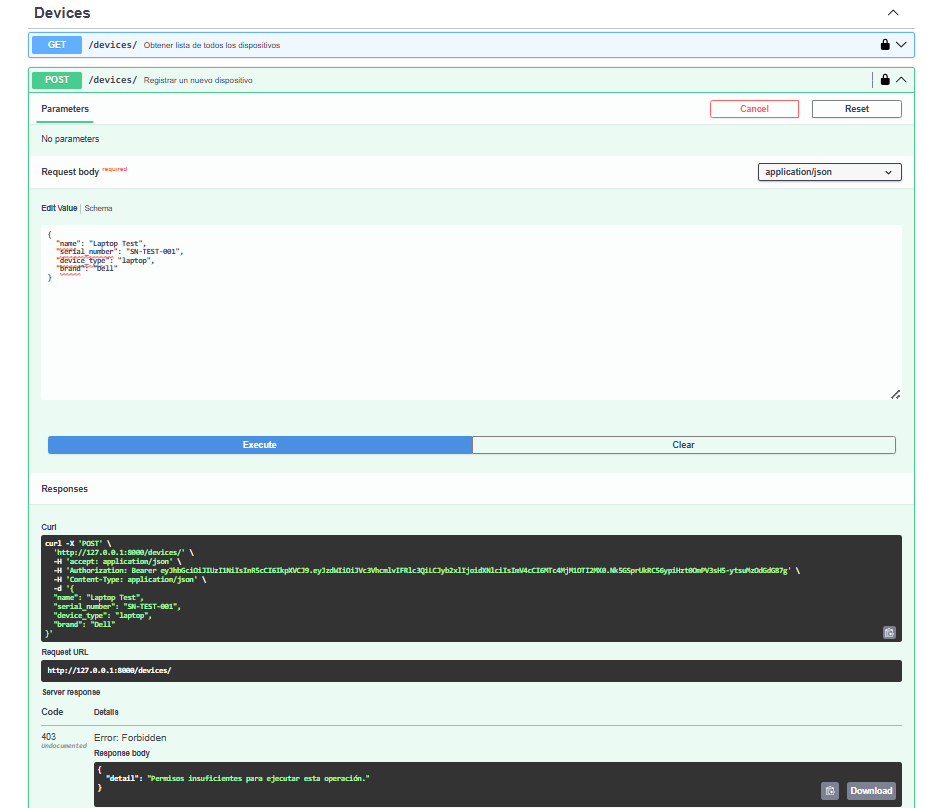

---

### 7. Swagger/OpenAPI con OAuth2

> _Vista general de Swagger UI mostrando todos los endpoints organizados por tags (Auth, Users, Devices, Loans) con los candaditos 🔒 en las rutas protegidas y el botón Authorize._

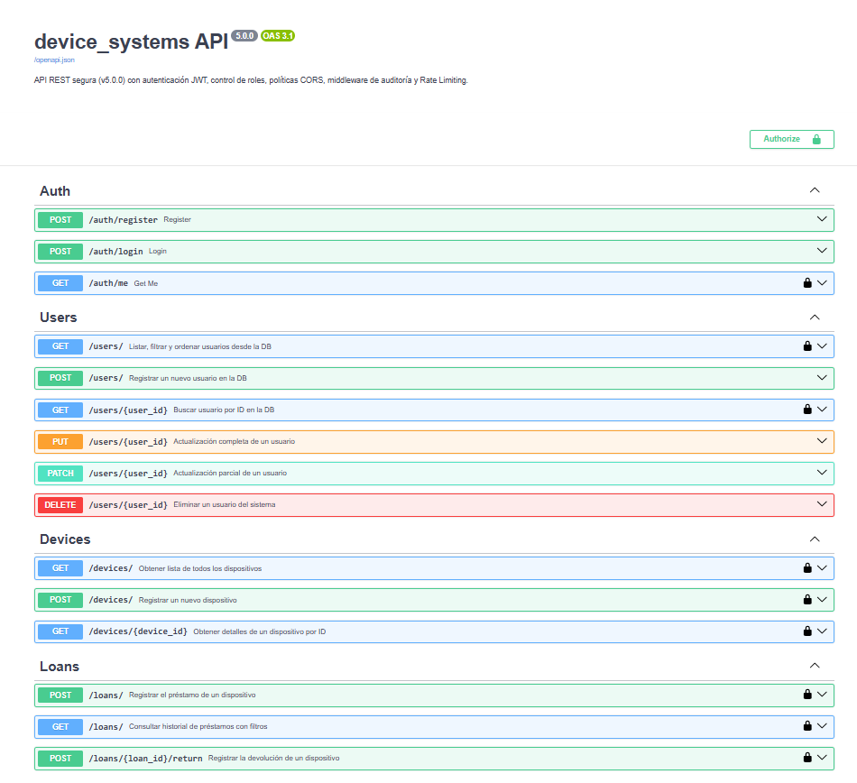

---

### 8. Rate limiting — `429 Too Many Requests`

> _Activación del rate limit en `POST /auth/login` al superar las 5 peticiones por minuto. La API responde `429 Too Many Requests` con el mensaje "Rate limit exceeded: 5 per 1 minute"._

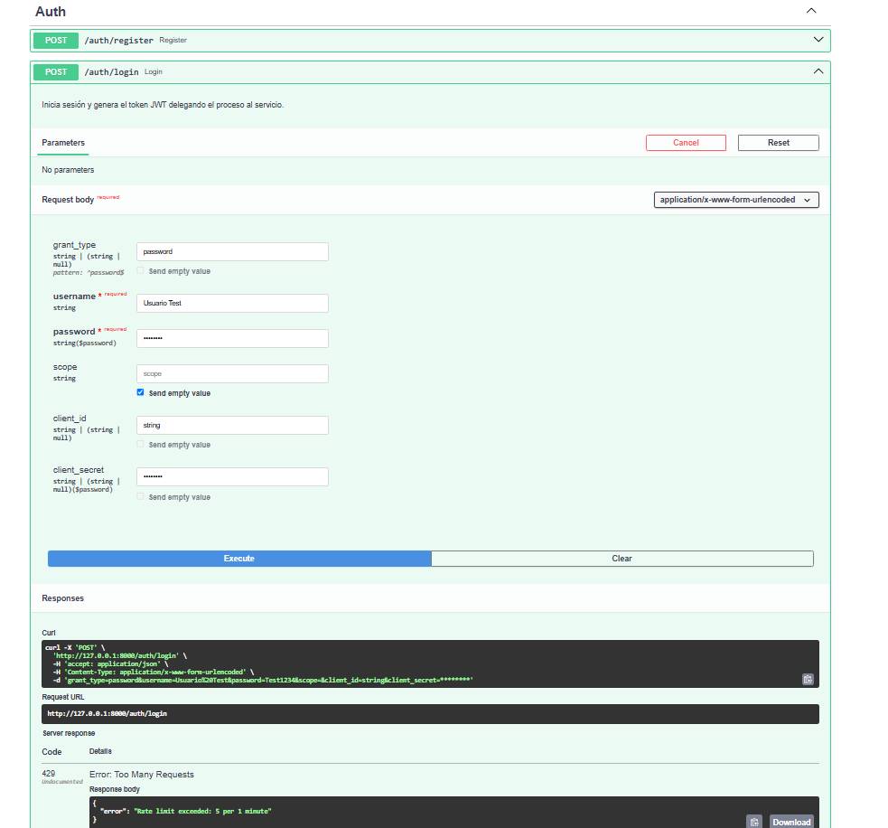

---

## CORS configurado

El proyecto configura `CORSMiddleware` en `main.py` para controlar qué orígenes pueden consumir la API:

```python
app.add_middleware(
    CORSMiddleware,
    allow_origins=[
        "http://localhost:5173",
        "http://localhost:3000"
    ],
    allow_credentials=True,
    allow_methods=["*"],
    allow_headers=["*"],
)
```

**¿Por qué no usar `allow_origins=["*"]` en producción cuando hay credenciales?**

Cuando `allow_credentials=True`, el navegador exige que `allow_origins` especifique dominios concretos. Si se usa `"*"` junto con credenciales, el navegador bloquea la petición por política de seguridad. Además, permitir todos los orígenes en producción expone la API a peticiones desde cualquier dominio malicioso, lo que puede facilitar ataques **CSRF** (Cross-Site Request Forgery) donde un sitio externo ejecuta acciones en nombre de un usuario autenticado. Por eso en producción siempre se deben listar explícitamente los dominios de confianza.

---

## Middleware personalizado

El middleware definido en `app/middlewares/request_middleware.py` intercepta cada petición y agrega automáticamente:

| Cabecera          | Descripción                                              |
|-------------------|----------------------------------------------------------|
| `X-App-Name`      | Nombre de la aplicación: `device_systems`                |
| `X-Process-Time`  | Tiempo de procesamiento de la petición en segundos       |
| `X-Request-ID`    | Identificador único por petición para trazabilidad       |

Además registra en consola el método HTTP, la ruta y el código de estado de cada request, lo que facilita el monitoreo y depuración del sistema.

---

## Autenticación JWT y protección de rutas

### Flujo de autenticación

1. El cliente hace `POST /auth/register` con username, email, contraseña y rol.
2. La contraseña se hashea con `bcrypt` antes de guardarse — nunca se almacena en texto plano.
3. El cliente hace `POST /auth/login` y recibe un `access_token` JWT firmado con la `SECRET_KEY` del `.env`.
4. El cliente envía el token en cada petición protegida: `Authorization: Bearer <token>`.
5. FastAPI valida el token mediante `Depends(get_current_active_user)` antes de ejecutar el endpoint.

### Roles y permisos

| Rol       | Acceso permitido                                         |
|-----------|----------------------------------------------------------|
| `admin`   | Todas las rutas protegidas                               |
| `support` | Rutas de devices y loans (no puede eliminar)             |
| `user`    | Solo rutas de autenticación y consultas básicas          |

Si el token es inválido o ausente → `401 Unauthorized`
Si el rol es insuficiente → `403 Forbidden`

---

## Rate Limiting

Configurado con `slowapi` para prevenir abuso de endpoints críticos:

| Endpoint              | Límite           |
|-----------------------|------------------|
| `POST /auth/register` | 3 por minuto     |
| `POST /auth/login`    | 5 por minuto     |
| `GET /users`          | 30 por minuto    |
| `POST /loans`         | 10 por minuto    |
| `GET /loans`          | 30 por minuto    |

Al superar el límite la API responde `429 Too Many Requests`.

---

## Reflexión sobre la importancia de la seguridad en APIs REST

Incorporar seguridad a la API fue el cambio más importante del proyecto hasta ahora, porque pasamos de una API funcional a una API profesional. Antes, cualquier persona con acceso al servidor podía leer usuarios, crear dispositivos o registrar préstamos sin ninguna restricción. Con esta entrega, cada operación sensible requiere identidad verificada y rol autorizado.

El uso de **JWT** fue clave para entender cómo funciona la autenticación sin estado: el servidor no guarda sesiones, sino que confía en la firma del token. Esto hace la API escalable y compatible con cualquier cliente frontend o móvil. Además, hashear las contraseñas con **bcrypt** garantiza que incluso si la base de datos se ve comprometida, las contraseñas reales nunca queden expuestas.

El **middleware** añadió visibilidad al sistema: cada petición queda registrada con su método, ruta, código de respuesta y tiempo de procesamiento. Esto es esencial en producción para detectar cuellos de botella o comportamientos anómalos.

Finalmente, el **rate limiting** demostró ser una capa de protección simple pero efectiva contra ataques de fuerza bruta, especialmente en endpoints de login y registro. Ver el `429 Too Many Requests` activarse en las pruebas confirmó que la protección funciona tal como se esperaba.

En conjunto, esta actividad mostró que la seguridad no es una característica opcional que se agrega al final, sino una responsabilidad que debe diseñarse desde el inicio de cualquier API que maneje datos de usuarios.

---
